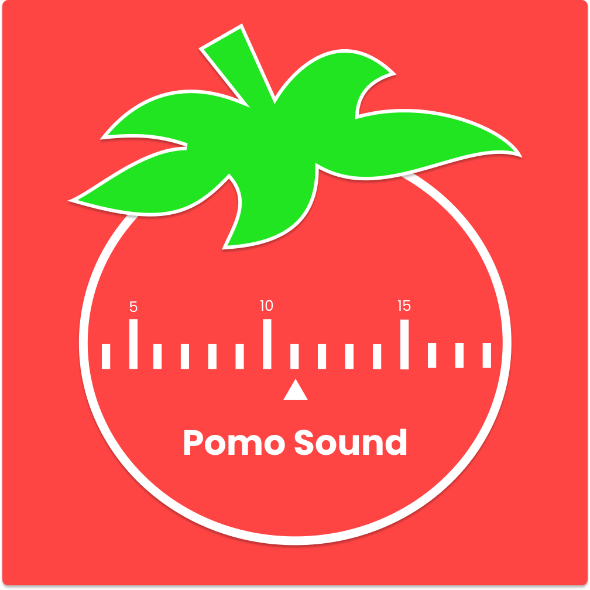

<h1 align="center">
  Pomo Sound
</h1>

 
  
  

  

 

  

## 🚧 Projeto

Este repositório é somente os assets da aplicação. Para acessar o repositório oficial é só acessar o link abaixo:

## [Pomo Sound](https://github.com/birobirobiro/pomo-sound)

Feito com ♥ by birobirobiro
